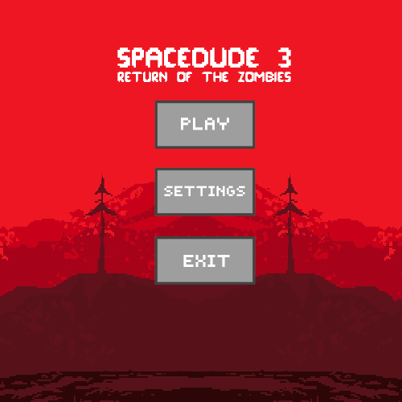
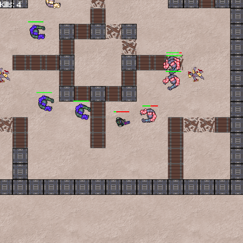
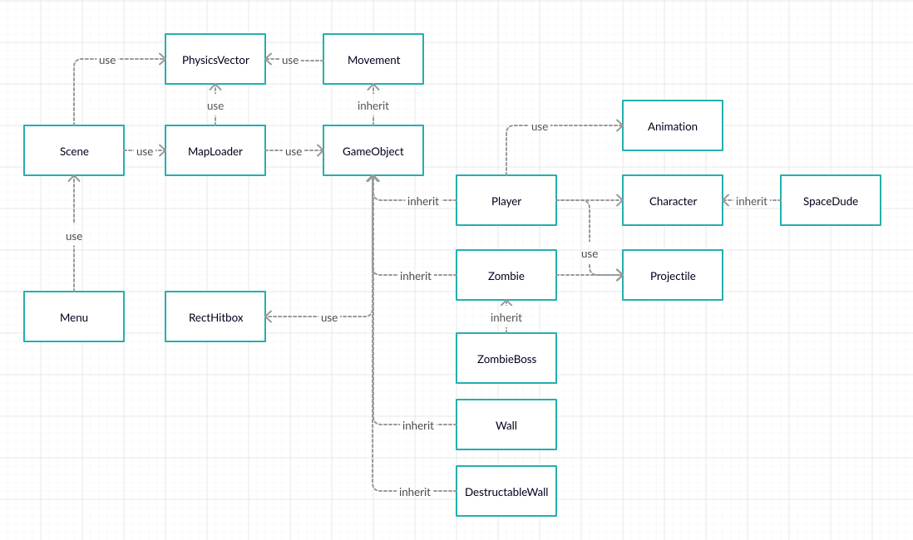

# Spacedude 3: Return of the Zombies

**Software project for ELEC-A7151 Object oriented programming with C++**

Simo Hakanummi, Toni Lyttinen, Toni Ojala & Mikko Suhonen

 

## Description

Spacedude 3: Return of the Zombies is a top-down shooter game that has 2 different game modes, multiple maps, self-drawn graphics and self-composed music.
The game is developed to be run on Linux and is not currenlty playable on any other platform.

## Features

* A [Brawl Stars](https://supercell.com/en/games/brawlstars/)-like game
* A real-time game
* 2D-graphics (top-down view)
* Pixelated art style
* Player has an inventory of weapons
* Two gamemodes
* Multiple maps to choose from for both game modes
* Easily editable maps
* Simple AI for enemies
* Different types of enemies
* Randomly chooses skins for zombies
* Bullets have random direction in a cone
* The game has self-drawn graphics and self-composed soundtrack

* The goal was to create an audio-visually pleasing game that is fun to play.
* Generally, the idea was to create a solid base structure for the game that can be extended and developed even after the course.

## Repository contents

It contains the following directories:

* `build/` -- Directory containing the compiled objects and binaries (executive)

* `doc/` -- Directory containing the documentation of the project
    * Git workflow instructions for the development of the project
    * Style guide for our project (basic 'rules' for coding style)
    * Documentation images

* `src/` -- Contains all the source code and other needed sources (e.g. textures and images)

* `Makefile` -- Make configuraion file for building the project

* `README.md` -- This file. Contains overview  and documentation of the project and repository

## Install dependencies

    sudo apt install libsfml-dev

## Compile and Run

Once you have the dependencies (see above), run the following command in your terminal:

    make run

## Controls

* WASD to move up, left, down an right
* Hold Left Shift to sprint while moving
* Move mouse cursor to aim
* Mouse left click to shoot (hold for fully automatic fire)
* Number button 1, 2 and 3 to change between equipment:
    * 1 (Blaster), 2 (Shotgun), 3 (Medikit)

## Gameplay

* The target can be one of the following, depending on the game mode:
    1. Campaign:
    * Kill all the enemies and find the goal portal
    2. Survial:
    * Survive as long as you can and kill as many enemies as possbile.
* Shoot the enemies with your weapon
* Shooting at enemies depletes their hitpoints
* When hitpoints reach zero, an entity dies
* Avoid getting hit by enemies to remain alive
* You can destroy wooden crates in your way during your adventures

## Map creation

* There is an easy way to create your own map for the game.
* A text editor and some general format information is needed.
* Maps directory is located within the src directory.
* One can edit any of the available maps in the directory.
* Do not rename the maps, their names are hard-coded into the game's menu system.
* The map file (.txt) consists of 3 blocks: gamemode, background and map
* #gamemode states the map's gamemode and it can be either campaign or survival
* #background contains a file path to a background image
* #map contains the block-level layout of the map.
Each block (64x64 px) is written as a character, divided by dashes (-)

Example of a map file:

<pre><code>    #gamemode
    campaign

    #background
    src/Textures/background_red.png

    #map
    w-w-w-w-w   // w = Wall
    w-.-P-.-w   // P = Player spawn point
    w-.-.-.-w   // Z = Zombie spawn point
    w-.-Z-.-w   // d = Breakable crate
    w-.-.-.-w   // X = Teleport that activates once all zombies are killed
    w-.-.-.-W   // S = Zombie spawner in survival mode
    w-d-d-d-w   // B = For some real challenge
    w-.-.-.-w   // . = Empty space
    w-.-X-.-w   // All building block symbols need to be separated from another by a dash.
    w-w-w-w-w   // For example w-.-P-.-w
</code></pre>

* Check the premade maps for ideas and more clarity on the formatting of the maps.

## Implementation Details

#### Libraries
We used [SFML](https://www.sfml-dev.org/) library to implement
our graphics, sounds and game structure.
We decided to use it because it seemed easy to use and suitable for our usage.
Also we were encouraged to use SFML by our project topic page.

#### Gameplay aspects
Originally we were set on implementing network features into the game.
Since it would have affected everything else drastically and would have demanded a total overhaul of the code
we had written so far. With time contraints in mind, we decided against network implementation and decided
to implement AI instead.

#### Testing
Testing of the game was done by building and locally running the game in every development phase, which was often done in branches.
Our policy was that master should always contain a functioning version of the program.

#### Memory management
We did try to use valgrind to test memory leaks, but it turned out difficult and not efficient
for the purpose since SFML and graphics card drivers etc. weren't compatible. We tried to manage memory
as well as we could given the challenging circumstances and structure. We utilized Rule of Three where applicable.

#### Error handling
The software has error processing for all used files (textures and map files) it opens, acts accordingly and gives an error message in the console.
In addition when input a corrupted/faulty mapfile, the software doesnt load the game and returns to menu.

#### Software structure

We used C++ standard library extensively and also created our own data strucutres to construct our software.
We overhauled some classes and added some extra features that were needed (for instance PhysicsVector is
basicly an overhauled sf::Vector2f with multiple extra features).

## Conclusion

We managed to implement a game that is fun to play and works robustly. The game has expansion potential for
a lot of applications and additional features, provided that the source code is slightly updated to be more flexible in certain areas (e.g. implementing networked gameplay would need ).
Generally the game has no known bugs apart from a very rare bug with gun sounds related to the SFML sound buffer limitations.
This is probably due to restraints of the SFML library. (also message AL lib: (EE) alc_cleanup: 1 device not closed also tends to appear in the console on exit)

We would've liked to make the game more expansive, but the extensiveness of our project suffered from time restraints
(e.g. changing plans to implement network play to AI enemies).
