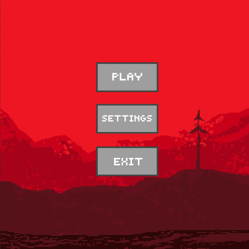
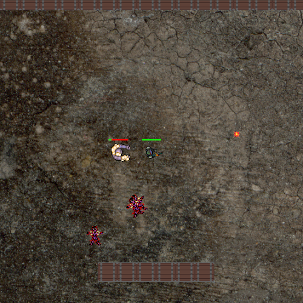

# Spacedude 3: Return of the Zombies

**Software Project for ELEC-A7151 Object oriented programming with C++**

Simo Hakanummi, Toni Lyttinen, Toni Ojala & Mikko Suhonen

 

## Features

* A [Brawl Stars](https://supercell.com/en/games/brawlstars/)-like game
* A real-time game
* 2D-graphics (top-down view)
* Pixelated art style
* Player has an inventory of weapons
* Two gamemodes
* Multiple maps to choose from for both game modes
* Easily editable maps
* Simple AI for enemies
* The game has self-drawn graphics and self-composed soundtrack
* The goal was to create an audio-visually pleasing game that is fun to play.
* Generally, the idea was to create a solid base structure for the game that can be extended and developed even after the course.

## Install dependencies

    sudo apt-get install libsfml-dev

## Compile and Run

Once you have the dependencies (see above), run the following command in your terminal:

    make run

## Controls

* WASD to move up, left, down an right
* Hold Left Shift to sprint while moving
* Move mouse cursor to aim
* Mouse left click to shoot (hold for fully automatic fire)
* Number button 1, 2 and 3 to change between equipment:
    * 1 (Blaster), 2 (Shotgun), 3 (Medikit).

## Gameplay

* The target can be one of the following, depending on the game mode:
    1. Campaign:
    * Kill all the enemies and find the goal portal
    2. Survial:
    * Survive as long as you can and kill as many enemies as possbile.
* Shoot the enemies with your weapon
* Shooting at enemies depletes their hitpoints
* When hitpoints reach zero, an entity dies
* Avoid getting hit by enemies to remain alive
* You can destroy wooden crates in your way during your adventures

## Map creation

* There is an easy way to create your own map for the game.
* A text editor and some general format information is needed.
* Maps directory is located within the src directory.
* One can edit any of the available maps in the directory.
* Do not rename the maps, their names are hard-coded into the game's menu system.
* The map file (.txt) consists of 3 blocks: gamemode, background and map
* #gamemode states the map's gamemode and it can be either campaign or survival
* #background contains a file path to a background image
* #map contains the block-level layout of the map.
Each block (64x64 px) is written as a character, divided by dashes (-)

Example of a map file:

<pre><code>    #gamemode
    campaign

    #background
    src/Textures/background_red.png

    #map
    w-w-w-w-w   // w = Wall
    w-.-P-.-w   // P = Player spawn point
    w-.-.-.-w   // Z = Zombie spawn point
    w-.-Z-.-w   // d = Breakable crate
    w-.-.-.-w   // X = Teleport that activates once all zombies are killed
    w-.-.-.-W   // S = Zombie spawner in survival mode
    w-d-d-d-w   // B = For some real challenge
    w-.-.-.-w   // . = Empty space
    w-.-X-.-w   // All building block symbols need to be separated from another by a dash.
    w-w-w-w-w   // For example w-.-P-.-w
</code></pre>

* Check the premade maps for ideas and more clarity on the formatting of the maps.

## Implementation Details

We used [SFML](https://www.sfml-dev.org/) library to implement
our graphics, sounds and game structure.
We decided to use it because it seemed easy to use and suitable for our usage.
Also we were encouraged to use SFML by our project topic page.

Originally we were set on implementing network features into the game.
But since it would have drastically cut into everything else and could have demanded a total overhaul of the code
we had written so far, with time contraints in mind, we decided against network implementation.

Testing of the game was done by building and locally running the game, this was often done in each project
members own branch. Our policy was that only running & functioning versions are to pushed unto master.